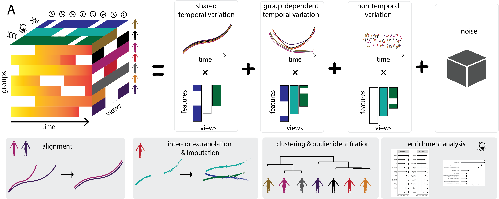

MEFISTO provides an unsupervised approach to integrate multi-modal data with continuous structures among the samples, e.g. given by spatial or temporal relationships. The aim of MEFISTO is to exploit such relationships between samples in the dimensionality reduction and disentangle smooth sources of variation given by factors that change gradually along the covariate and other source of variation that are independent of the covariate. Furthermore, it enables to interpolate/extrapolate to unseen timepoints or locations. 

If multiple groups of samples are present, e.g. timecourses from different individuals, MEFISTO furthermore models the heterogeneity of the temporal or spatial patterns across groups and allows to align timepoints across the groups, in cases where there are no clear or imperfect correspondences between groups.

<p align="center"> 
​
</p>

For more details you can read our preprint: 
-  [*Identifying temporal and spatial patterns of variation from multi-modal data using MEFISTO (2020)*](https://www.biorxiv.org/content/10.1101/2020.11.03.366674v1?rss=1)

## FAQ

**(1) When should I use MEFISTO instead of MOFA?**  
If you have metadata on your samples that give information on how samples relate to one another such as temporal or spatial positions. Using such known similarities can improve the inferred factors, provides the ability to interpolate and enables to separate factors that vary smoothly along these known covariates and those that capture variation independent of them. In particular with many missing sample-view combinations, MOFA(+) can have difficulties to detect such smooth sources of variation. By exploiting known relationships between samples, MEFISTO can better infer such smooth variation.

**(2) What is the input to MEFISTO?**
Along with the omics data (as in MOFA) you now additionally need to provide a matrix containing covariate value for each sample. This can for instance be a single covariate such as a time point per sample or multiple covariates such as x-,y- coordinate of spatial postions. 

**(3) How does the smooth factor inference work in MEFISTO?**
Like in MOFA, factors are inferred to represent the driving sources of variation across data modalities. By specifying sample covariates the model is encoraged to learn factors that vary smoothly along the covariates. This is implemented using a Gaussian process prior for the factors with a squared exponential kernel in the covariates. For each factor the model learns a different scale parameter: For factors that vary smoothly with covariate this will be close to one, factors that capture variation independent of the covariate will have a scale close to 0.

**(4) Can I use multiple groups in MEFISTO?**
Yes you can. If you have multiple repeated measurement on spatial or temporal data, e.g. time course data from multiple individuals. You can specify the groups as described for MOFA+. MEFISTO will then infer latent processes for each group and (if `model_groups` is set to True) infer a group-group correlation matrix that indicated for each latent components how the groups relate to one another. See also out evodevo tutorial for an example. Note that setting `model_groups` to True can be slow for large number of groups. In this case, we recommend setting it to False for initial analysis. 

**(5) What if my covariates are not aligned across groups?**
If you have muliple groups where the covariate is not aligned, e.g. time course data across development from different species, MEFISTO provides an option to learn an optimal alignment. For this, use the `warping` option. See also our evodevo tutorial for an example.


## Installation

Currently, MEFISTO still lives on a separate branch and will be merged in the coming days.
If you want work with it before the merge is concluded, please clone the repository and switch to the mefisto branch. Installation can be done as detailed below.

### Python dependencies 

Python dependencies can be installed using pip (from the Unix terminal)

```r
git clone https://github.com/bioFAM/MOFA2
git checkout mefisto
pyton setup.py install
```

### R package

The R package can be installed using R:

```r
remotes::install_github("bioFAM/MOFA2/MOFA2", ref= "mefisto", build_opts = c("--no-resave-data --no-build-vignettes"))
# or use the devtools::install_github() equivalent
```


## Tutorials/Vignettes
* [**MEFISTO with temporal data**](https://raw.githack.com/bioFAM/MEFISTO_tutorials/master/MEFISTO_temporal.html): illustration of the method with a temporal covariate
* [**MEFISTO with spatial data**](https://raw.githack.com/bioFAM/MEFISTO_tutorials/master/MEFISTO_spatial.html): illustration of the method with a spatial covariate
* [**Application to an evodevo gene expression atlas**](https://raw.githack.com/bioFAM/MEFISTO_tutorials/master/evodevo_tutorial.html): gene expression data from 5 species and 5 organs across development
* **Application to a longitudinal microbiome data set** in preparation... (preliminary code can be found in https://github.com/bioFAM/MEFISTO_analyses/evodevo/ECAM_analysis.Rmd)
* **Application to spatial transcritptomics data** in preparation... (preliminary code can be found in https://github.com/bioFAM/MEFISTO_analyses/evodevo/spatial_transcriptomics.Rmd)

