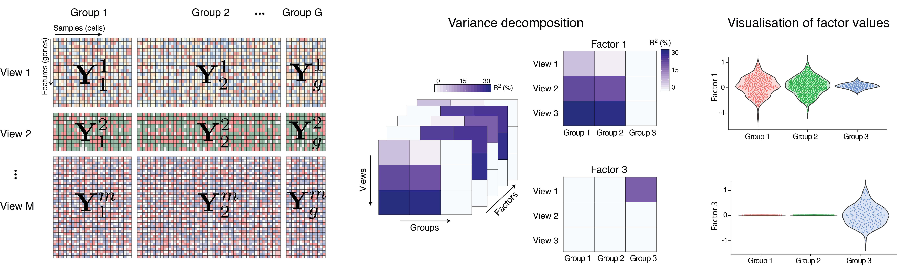

```{r}
library(data.table)
library(purrr)
library(MOFA2)
```

# Description

MOFA is a (Bayesian) factor analysis model that provides **a general framework for the unsupervised integration of multi-omic data sets**. Briefly, MOFA aims at disentangling the sources of variation in a multi-omics data set, and detect the ones which are shared between assays from the ones that are driven by a single assay.

In our new model design (MOFA+) we generalise this strategy to also enable **the integration of multiple groups of data**, where groups are typically different cohorts, time points, experiments, etc. When using the multi-group functionality, the model will quantify the variance explained by each latent factor in each group. See for example the following figure:

<p align="center"> 
​
</p>

(EXAMPLE) The input data consists of three views and three groups. The model has detected 4 latent factors. Factor 1 drives a lot of signal in view 2 and view 3, but no variance in view 1. However, this variation is only captured in group A and B, not in group C. Hence, whatever Factor 1 is (let's say cell cycle variation), MOFA indicates that all samples in group 3 do not manifest such variation.

In conclusion, MOFA+ provides a principled approach to decompose the modes of variation in complex and structured data sets.

# Data processing

### Normalisation
Proper normalisation of the data is critical for the model to work. 
For count-based data such as scRNA-seq or scATAC-seq we recommend size factor normalisation + variance stabilisation. 

### Filtering
It is strongly recommended that you filter highly variable features (HVGs) per assay.
Importantly, when doing multi-group inference, you have to regress out the group effect before selecting HVGs, otherwise you will enrich for features that show differences in their mean between groups.

Also, it is recommended that data sets have similar dimensionalities. Bigger data modalities will tend to be overrepresented in the output. Sometimes this is just unavoidable, but it is good practice to filter features in order to have similar number of features per view (or as similar as possible).

### Batch effect corrections
If you have variation that you don't want MOFA to capture, you should regress it out before fitting the model. We provide the function `regress_covariates` to regress out covariates in the data.


# Training the model
The core of the model is implemented in Python (mofapy2 package), but the first steps of data processing and model training can be done either in R. After the model is trained, we only provide downstream analysis functionalities in R.  

To continue with the getting started tutorial, you need to choose the [python path](XXX) or the [R path](XXX). 

# Downstream analysis
If you already have trained your model, you can follow [this vignette](XXX) for the downstream analysis (in R)
