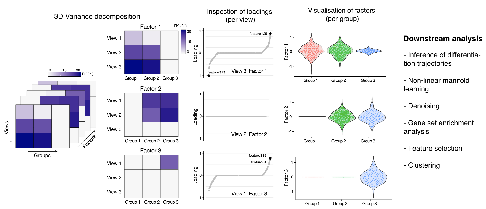

# Description

MOFA is a (Bayesian) factor analysis model that provides **a general framework for the unsupervised integration of multi-omic data sets**. Briefly, MOFA aims at disentangling the sources of variation in a multi-omics data set, and detect the ones which are shared between assays from the ones that are driven by a single assay. It provides a principled approach to decompose the modes of variation in complex and structured data sets.   

In our new model design (MOFA+) we generalise this strategy to also enable **the integration of multiple groups of data**, where groups are typically different cohorts, time points, experiments, etc. When using the multi-group functionality, the model will quantify the variance explained by each latent factor in each group.  

See for example the following figure:

 

In this example, the input data consists of three views and three groups. The model has detected 4 latent factors. Factor 1 drives a lot of signal in view 2 and view 3, but no variance in view 1. However, this variation is only captured in group A and B, not in group C. Hence, whatever Factor 1 is (let's say cell cycle variation), MOFA indicates that all samples in group 3 do not manifest such variation.

# 1) Data processing

### 1.1) Normalisation
Proper normalisation of the data is critical for the model to work. 
The model can handle three types of data: continuous (prefered, modelled with a gaussian likelihood), counts (modelled with a Poisson likelihood) and binary measurements (modelled with a bernoulli likelihood).  
We recommend the user to adopt the gaussian likelihood where possible. Hence, for count-based data such as scRNA-seq or scATAC-seq we recommend size factor normalisation + variance stabilisation. 

### 1.2) Filtering
It is strongly recommended that you filter highly variable features (HVGs) per assay before fitting the model. This ensures faster and more robust inference.  
Importantly, when doing multi-group inference in MOFA+, you have to regress out the group effect before selecting HVGs. Otherwise you will enrich for features that show differences in their mean between groups. Keep in mind that MOFA+ exploits the covariation between features, not the global levels!  

Also, it is recommended that data sets have similar dimensionalities. Bigger data modalities tend to dominate the signal. When possible, it is good practice to filter features in order to have similar number of features per view.

### 1.3) Batch effect corrections
If you have variation that you don't want MOFA to capture, you should regress it out before fitting the model. We provide the function `regress_covariates` to regress out covariates in the data.

# 2) Training the model
The core of the model is implemented in Python (`mofapy2` package), but the first steps of data processing and model training can be done either in R with the `MOFA2` package.
To continue with the getting started tutorial, you need to choose the python path or the R path.

## 2.1) Training the model in Python
Recommended, it is easier and faster. See [Training the model in Python](https://github.com/bioFAM/MOFA2/blob/master/mofapy2/notebooks/getting_started_python.ipynb)

## 2.2) Training the model in R
R requires the package `reticulate` to communicate with Python, and this is the source of most of the installation problems. If you still want to follow this path, see [Training the model in R](https://raw.githack.com/bioFAM/MOFA2/master/MOFA2/vignettes/getting_started_R.html)

# 3) Downstream analysis
After the model is trained, we only provide downstream analysis functionalities in R (for now). This is demonstrated in [this vignette](https://raw.githack.com/bioFAM/MOFA2/master/MOFA2/vignettes/downstream_analysis.html).
