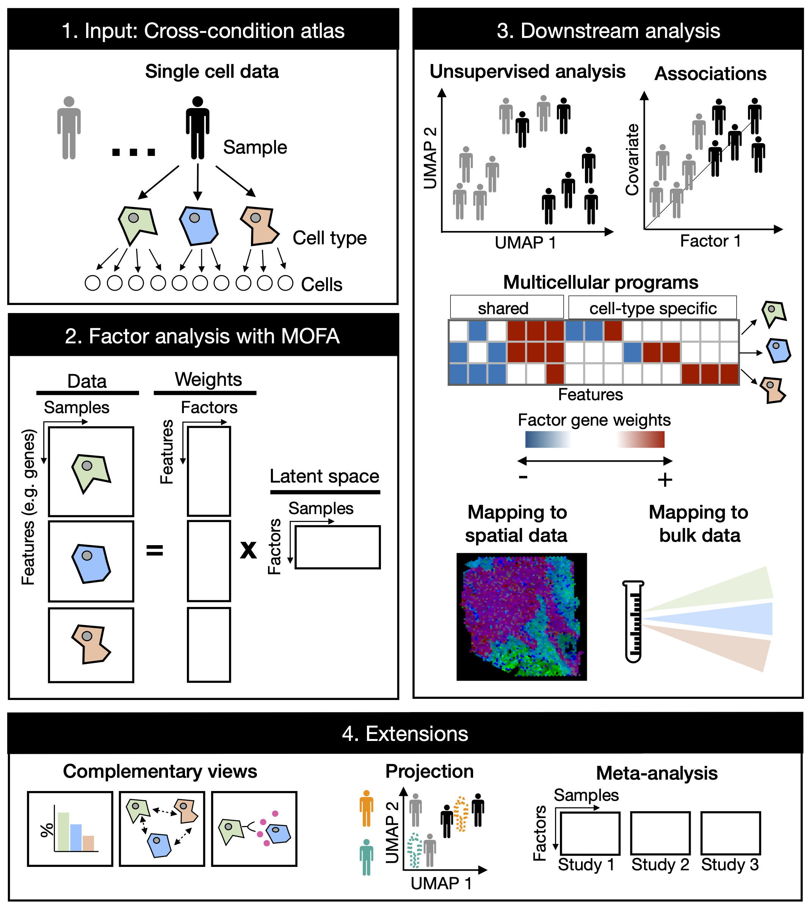

Cross-condition single-cell omics data profile the variability of cells across cell-types, patients, and conditions. Multicellular factor analysis (MOFAcell) repurposes MOFA to estimate cross-condition multicellular programs from single-cell data. These multicellular programs represent coordinated molecular changes occurring in multiple cells and can be used for the unsupervised analysis of samples in single-cell data of multiple samples and conditions. The flexibility in view creation allows the inclusion of structural (eg. spatial dependencies) or communication tissue-level views in the inference of multicellular programs. Leveraging on MOFA’s structured regularization MOFAcell is also suitable for meta-analysis and the joint modeling of independent studies.

 
​

For more details you can read our paper: \n

-  [*Multicellular factor analysis of single-cell data for a tissue-centric understanding of disease (eLife 2023)*](https://elifesciences.org/articles/93161)

## Use

We have created a complementary R package [MOFAcellulaR](https://github.com/saezlab/MOFAcellulaR) that contains helper fuctions to prepare your single-cell data for a multicellular factor analysis with MOFA.

A python implementation with [muon](https://muon.scverse.org/) is available through [liana-py](https://liana-py.readthedocs.io/en/latest/index.html)

## Tutorials/Vignettes
* [**Running a multicellular factor analysis in a cross-condition single-cell atlas**](https://saezlab.github.io/MOFAcellulaR/articles/get-started.html): illustration of the method with a toy example

### Python Tutorials
 * [**Running a multicellular factor analysis in a cross-condition single-cell atlas**](https://liana-py.readthedocs.io/en/latest/notebooks/mofacellular.html): illustration of the method with real data
 * [**Multicellular factor analysis for intercellular context factorization**](https://liana-py.readthedocs.io/en/latest/notebooks/mofatalk.html): inference of multicellular programs from cell-cell communication inference scores
