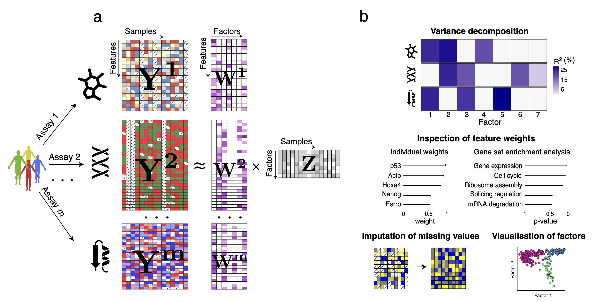

MOFA is a factor analysis model that provides a **general framework for the integration of multi-omic data sets** in an unsupervised fashion.  
Intuitively, MOFA can be viewed as a versatile and statistically rigorous generalization of principal component analysis to multi-omics data. Given several data matrices with measurements of multiple -omics data types on the same or on overlapping sets of samples, MOFA infers an **interpretable low-dimensional representation in terms of a few latent factors**. These learnt factors represent the driving sources of variation across data modalities, thus facilitating the identification of cellular states or disease subgroups. 

 

For more details you can read our papers: 
- general framework: [published in in Molecular Systems Biology](http://msb.embopress.org/cgi/doi/10.15252/msb.20178124)  
- multi-group framework and single cell applications: [MOFA+, published in Genome Biology](http://genomebiology.biomedcentral.com/articles/10.1186/s13059-020-02015-1)
- temporal or spatial data: [MEFISTO, bioRxiv](https://www.biorxiv.org/content/10.1101/2020.11.03.366674v1?rss=1)

## Implementation
MOFA is implemented in Python (`mofapy2`) and R (`MOFA2`). See [Installation](https://biofam.github.io/MOFA2/installation.html) for installation instructions. Previous implementations of MOFA (`mofapy` and `MOFA`) are deprecated and no longer maintained. See [News](https://biofam.github.io/MOFA2/NEWS.html) for an overview of changes in the most recent version of the implemenation and a comparison to older implementations.

